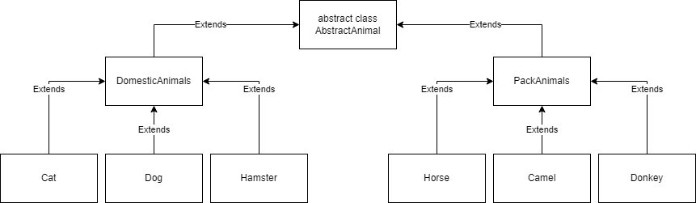

1. Используя команду cat в терминале операционной системы Linux, создать
два файла Домашние животные (заполнив файл собаками, кошками,
хомяками) и Вьючные животными заполнив файл Лошадьми, верблюдами и
ослы), а затем объединить их. Просмотреть содержимое созданного файла.
Переименовать файл, дав ему новое имя (Друзья человека)

```
cat > DomesticAnimals
	cat
	dog
	hamster
	<ctrl+d>
cat > PackAnimals
	horse
	camel
	donkey
	<ctrl+d>
cat DomesticAnimals PackAnimals > CombinedAnimals
cat CombinedAnimals
mv CombinedAnimals PeoplesFriends
```

2. Создать директорию, переместить файл туда.
```
mkdir controlwork
mv DomesticAnimals contolwork/
mv PackAnimals contolwork/
mv PeoplesFriends controlwork/
```

3. Подключить дополнительный репозиторий MySQL. Установить любой пакет
из этого репозитория.

`v`

PS. тут скорее всего имеется в виду дополнительны репозиторий для линукса, из которого будет установлен mysql
https://www.digitalocean.com/community/tutorials/how-to-install-the-latest-mysql-on-ubuntu-20-04

```
cd /tmp
curl -OL https://dev.mysql.com/get/mysql-apt-config_0.8.28-1_all.deb
sudo dpkg -i mysql-apt-config*
# в появишвимся окне нажимае ok
sudo apt update
rm mysql-apt-config*

sudo apt install mysql-server
systemctl status mysql
mysql_secure_installation
mysqladmin -u root -p version
```

4. Установить и удалить deb-пакет с помощью dpkg.
то что мы и делали в пункте 3.
```
curl -OL https://dev.mysql.com/get/mysql-apt-config_0.8.28-1_all.deb
sudo dpkg -i mysql-apt-config*
sudo apt update
rm mysql-apt-config*
```

5. Выложить историю команд в терминале ubuntu

`v`

вывести историю команд в убунту можно с помощью команды `history`
история же *нужных* команд уже была отображена в прошлых заданиях

7. Нарисовать диаграмму, в которой есть класс родительский класс, домашние
животные и вьючные животные, в составы которых в случае домашних
животных войдут классы: собаки, кошки, хомяки, а в класс вьючные животные
войдут: Лошади, верблюды и ослы).


8. В подключенном MySQL репозитории создать базу данных “Друзья
человека”

`v`

пкм по пустому месту в навигаторе и выбираем `Create Schema...`


enter name of scheme and click apply


вылезет окошко в котором мы снова должны нажать apply


или можно просто ввести команду в свободный sql файл и запустить его
```mysql
CREATE SCHEMA `humanfriends` ;
```

8. Создать таблицы с иерархией из диаграммы в БД
```mysql
use humanfriends;

CREATE TABLE IF NOT EXISTS AbstractAnimal(
	id INT AUTO_INCREMENT NOT NULL PRIMARY KEY,
    animalType varchar(30)
	);
    
INSERT INTO AbstractAnimal(animalType)
VALUES
	('domesticAnimals'),
    ('packAnimals');

CREATE TABLE IF NOT EXISTS Species(
	id INT AUTO_INCREMENT NOT NULL PRIMARY KEY,
    speciesType varchar(30),
    animalType_id INT,
    CONSTRAINT fk_animalType FOREIGN KEY(animalType_id) REFERENCES AbstractAnimal(id)
    );
    
INSERT INTO Species(speciesType, animalType_id)
VALUES
	('cat', 1),
    ('dog', 1),
    ('hamster',1),
    ('horse', 2),
    ('camel', 2),
    ('donkey', 2);
    
SELECT Species.id ,Species.speciesType, AbstractAnimal.animalType AS animalType_idspecies
FROM Species
JOIN AbstractAnimal ON Species.animalType_id = AbstractAnimal.id;
```


9. Заполнить низкоуровневые таблицы именами(животных), командами
которые они выполняют и датами рождения

сначала добавим 
```mysql
CREATE TABLE IF NOT EXISTS Animals(
	id INT AUTO_INCREMENT NOT NULL PRIMARY KEY,
    animalName VARCHAR(30),
    type_id INT,
    birthday DATE,
    CONSTRAINT fk_type FOREIGN KEY (type_id) REFERENCES Species(id)
    );

INSERT INTO Animals(animalName, type_id, birthday)
VALUES
	('snow', 1, '2020-01-01'),
    ('barsik', 1, '2019-01-01'),
    ('bobik', 2, '2019-03-12'),
    ('petya', 3, '2021-10-03'),
    ('pyero', 4, '2017-04-04'),
    ('jora', 5, '2015-11-16'),
    ('rjaka', 6, '2016-07-03');
    
SELECT * FROM Animals a
JOIN Species s ON a.type_id = s.id
JOIN AbstractAnimal aa ON s.animalType_id = aa.id;
```


добавим таблицу комманд в которой укажем имя команды и id конкретного животного который умеет её исполнять
```mysql
CREATE TABLE IF NOT EXISTS Commands(
	id INT AUTO_INCREMENT NOT NULL PRIMARY KEY,
    commandName varchar(30),
    animal_id INT,
    CONSTRAINT fk_animal FOREIGN KEY (animal_id) REFERENCES Animals(id)
    );
    
INSERT INTO Commands(commandName, animal_id)
VALUES
	('come', 1), ('paw', 1),
    ('come', 2), ('lay', 2),
    ('sit', 3), ('voice', 3), ('hold', 3),
    ('die', 4),
    ('galop', 5), ('stop', 5),
    ('stop', 6), ('lay', 6),
    ('laugh', 7);
    
SELECT a.id, a.animalName, a.birthday, s.speciesType, aa.animalType,
		GROUP_CONCAT(c.commandName SEPARATOR ', ') AS commands
FROM Animals a
JOIN Species s ON a.type_id = s.id
JOIN AbstractAnimal aa ON s.animalType_id = aa.id
JOIN Commands c ON c.animal_id = a.id
GROUP BY a.id;
```


10. Удалив из таблицы верблюдов, т.к. верблюдов решили перевезти в другой
питомник на зимовку. Объединить таблицы лошади, и ослы в одну таблицу.
```mysql
# deleting commands thats below to camels, and then camels itself
DELETE FROM Commands
	WHERE animal_id = (SELECT id FROM Animals WHERE type_id = 5);
DELETE FROM animals WHERE type_id = 5;
```


```mysql
# creating new species horse_donkey to replace all horses and donkeys to that
INSERT INTO species(speciesType,animalType_id) VALUES ('horse_donkey', 2);
UPDATE Animals SET type_id = 7 WHERE type_id IN (4, 6);

# printing all info
SELECT a.id, a.animalName, a.birthday, s.speciesType, aa.animalType,
		GROUP_CONCAT(c.commandName SEPARATOR ', ') AS commands
FROM Animals a
JOIN Species s ON a.type_id = s.id
JOIN AbstractAnimal aa ON s.animalType_id = aa.id
JOIN Commands c ON c.animal_id = a.id
GROUP BY a.id;
```


11. Создать новую таблицу “молодые животные” в которую попадут все
животные старше 1 года, но младше 3 лет и в отдельном столбце с точностью
до месяца подсчитать возраст животных в новой таблице
```mysql
CREATE VIEW youngAnimals AS
SELECT a.id, a.animalName, a.birthday, s.speciesType,
	CONCAT(TIMESTAMPDIFF(YEAR, a.birthday, CURDATE()),
			' years ',
            TIMESTAMPDIFF(MONTH, a.birthday, CURDATE()) % 12,
            'month(s)')
FROM animals a
LEFT JOIN commands c ON c.animal_id = a.id
JOIN species s ON a.type_id = s.id
JOIN abstractanimal aa ON s.animalType_id = aa.id
WHERE TIMESTAMPDIFF(YEAR, a.birthday, CURDATE()) BETWEEN 1 and 2;

SELECT * FROM youngAnimals;
```


12. Объединить все таблицы в одну, при этом сохраняя поля, указывающие на
прошлую принадлежность к старым таблицам.
```mysql
CREATE VIEW combinedTable AS
SELECT a.id, a.animalName, a.birthday, ya.age,
GROUP_CONCAT(c.commandName SEPARATOR ', ') AS commands,
s.speciesType,
aa.animalType
FROM animals a
LEFT JOIN younganimals ya ON ya.id = a.id
LEFT JOIN commands c ON c.animal_id = a.id
JOIN species s ON s.id = a.type_id
JOIN abstractanimal aa ON aa.id = s.animalType_id
GROUP BY a.id;

SELECT * FROM combinedTable;
```


